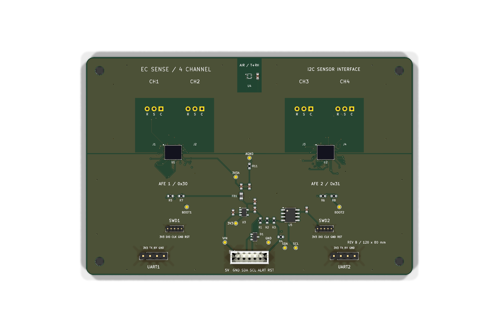

# MINTS-Astra-Daughterboard

120 × 80 mm, four-layer EC Sense gas-sensor I2C daughterboard, revision B. The project contains the editable KiCad schematic and PCB, local component libraries, manufacturing files, assembly data, source scripts, reference documents, and verification reports.

## Open the design

Open [`ECSense_4CH_I2C.kicad_pro`](ECSense_4CH_I2C.kicad_pro) in KiCad 10. The project uses local footprint and 3D-model paths. The schematic and board retain their original `ECSense_4CH_I2C` filenames so project references remain intact.

Read [`PCB_README.md`](PCB_README.md) for electrical corrections, connector pinouts, assembly requirements, and bring-up instructions.

## Files

| Location | Contents |
| --- | --- |
| [`ECSense_4CH_I2C.kicad_pcb`](ECSense_4CH_I2C.kicad_pcb) | Completed routed PCB |
| [`ECSense_4CH_I2C.kicad_sch`](ECSense_4CH_I2C.kicad_sch) | Revision B schematic |
| [`ECGAS.pretty/`](ECGAS.pretty), [`libraries/`](libraries), [`models/`](models) | Local footprints and available 3D models |
| [`manufacturing/gerbers/`](manufacturing/gerbers) | Four copper layers, masks, silkscreens, pastes, outline, and drill files |
| [`manufacturing/assembly/`](manufacturing/assembly) | BOM and placement CSVs |
| [`Fabrication and assembly drawings`](output/pdf/Fabrication_and_assembly.pdf) | Mechanical, assembly, and drill drawings |
| [`Schematic PDF`](ECSense_4CH_I2C.pdf) | Printable schematic |
| [`output/`](output) | Board previews and final drawings |
| [`verification/`](verification) | Final checks plus development and routing records |
| [`scripts/`](scripts) | Construction, routing, and export scripts |
| [`sources/`](sources) | Manufacturer reference documents |

Download the [`complete project ZIP`](EC-Sense-120x80-Project.zip) or [`fabrication Gerbers ZIP`](manufacturing/EC-Sense-120x80-Gerbers.zip). The complete project ZIP is the compact release package; this repository also includes supporting development files.

## Verification and fabrication

The final KiCad 10.0.5 checks recorded **0 DRC violations, 0 unconnected items, 0 schematic parity discrepancies, and 0 ERC violations**. See [`final-drc.rpt`](verification/final-drc.rpt), [`final-erc.rpt`](verification/final-erc.rpt), and [`release-summary.json`](verification/release-summary.json). Earlier reports in `verification/` record intermediate work; the `final-*` reports describe the delivered board.

Specify four copper layers, nominal 1.6 mm FR-4, ENIG, and a fabricator supporting **0.075 mm trace/clearance and 0.20 mm via drills with 0.40 mm pads**. Read the full [fabrication notes](manufacturing/FABRICATION_NOTES.txt) before ordering.

This is a hardware prototype. Application firmware, gas-sensor calibration, and physical bench testing are required before use.

## Development records

The saved revision B KiCad project and `PCB_README.md` are authoritative. `DESIGN.md`, the original generator, and intermediate routing files document earlier stages. Construction scripts can overwrite completed routing; review them before running them. Local automatic backups, temporary files, editor state, and caches are ignored by Git.

Third-party KiCad library notices are included in [`libraries/LICENSE.md`](libraries/LICENSE.md) and [`models/kicad/LICENSE.md`](models/kicad/LICENSE.md).
